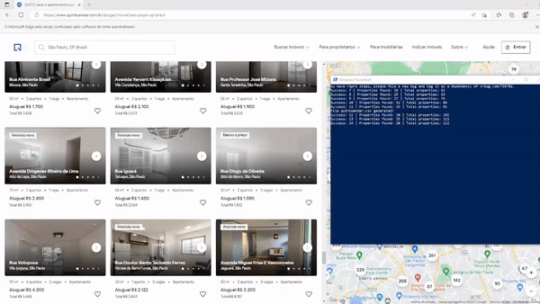

<p align="center">
 
 
</p>


## :house_with_garden: Description
Webscrapping project to scrape rent properties content in São Paulo - SP, using the brazilian famous housing website QuintoAndar. 

## :hammer: How to use
You'll need to install the following packages to run the program correctly:
- WebDriver Microsoft Edge (it's included in this repository)
- Selenium
- Pandas

Make sure to install the [requirements.txt](https://github.com/renat0sn/QuintoAndar-WebScrapping/blob/main/requirements.txt) to ensure that all packages is correctly installed:
```
pip install -r requirements.txt
```

## :airplane: Usage
Running [main.py](https://github.com/renat0sn/QuintoAndar-WebScrapping/blob/main/main.py) file, you'll notice a browser opening, entering the website and interacting with the page, collecting data and exporting to a csv file every hundred new registries.

The program will work like this:

<p>

</p>

## :telephone_receiver: Contact
E-mail: renato.sousa.gc@hotmail.com  &nbsp;&middot;&nbsp;
[Linkedin](https://www.linkedin.com/in/renato-sousa-nakano-810285219/)  &nbsp;&middot;&nbsp;
[Kaggle](https://www.kaggle.com/renatosn)
